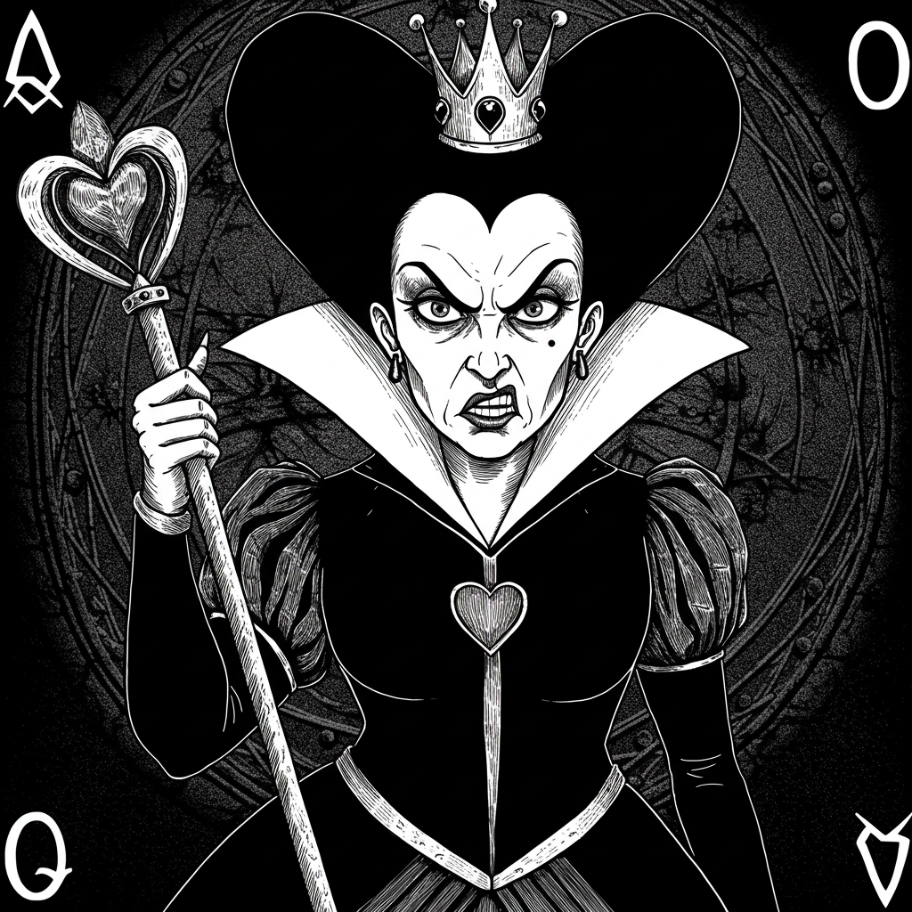

  

# **O Jogo da Rainha do Castelo**

## **História:**

Você foi capturado e levado ao **Castelo das Sombras**, um lugar de mistério e terror onde o ar é denso com o peso de almas perdidas. Ao chegar, é recepcionado pela **Rainha do Castelo**, uma figura temível que detém o controle sobre a vida e a morte. Com um olhar penetrante, ela lhe oferece uma única chance de escapar: **um jogo de sorte e coragem**.

A Rainha, com um sorriso frio e implacável, lhe apresenta um baralho mágico. Não se trata de um baralho comum, mas sim de cartas que definem destinos. **Cada carta no baralho possui um número**, e você deverá seguir um **ritual antigo** para determinar qual número será o último a restar. Somente **a carta sobrevivente** permitirá que você escape do castelo com vida.

## **A Missão:**

1. **O Baralho**: Você deverá formar um baralho de cartas com números de **1 a 52**. Porém, o número de cartas não será fixo: **você escolherá quantas cartas o baralho terá**, mas o número deve estar entre **1 e 52**.
2. **O Ritual**: Uma vez que o baralho tenha sido criado, a Rainha ordena que você **remova a primeira carta** da pilha e **coloque a segunda carta no final**. Este ritual deve ser repetido até que **apenas uma carta permaneça**.
3. **A Carta Final**: A última carta que restar após o ritual será a **única chave para sua sobrevivência**. **Qual número será o escolhido pela sorte?**

## **Desafio:**

- Crie o baralho com a quantidade de cartas escolhida (entre 1 e 52).
- A cada passo, remova a carta no topo da pilha e passe a segunda carta para o final.
- O jogo termina quando sobra **apenas uma carta**.
- Imprima o **número final** da carta que restou.

## **Exemplo de Execução:**

Se você decidir criar um baralho de **5 cartas** (por exemplo, [1, 2, 3, 4, 5]), o processo seria o seguinte:

- **Passo 1**: Retira a carta **1** e coloca a carta **2** no final.
- **Passo 2**: Retira a carta **3** e coloca a carta **4** no final.
- **Passo 3**: Continue o processo até que **uma única carta** sobre.

No final, o número da carta final será o número **vencedor**, aquele que **sobreviveu ao ritual**.

## **Nota da Rainha:**  
Se você falhar, ficará preso para sempre nas masmorras do castelo, enquanto os ecos das almas perdidas ecoam em seus ouvidos. **A sorte está em suas mãos... ou em sua morte.**

---

### **Boa sorte, e que o destino escolha você!** 👑
